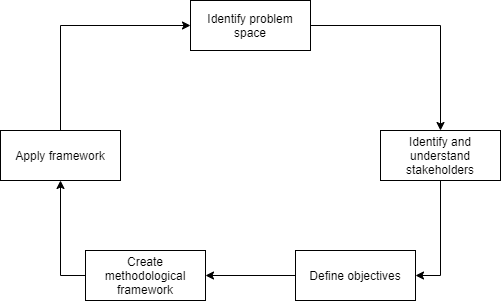

Overview
=======================

One of the main contributions of this document is to provide guidance on an approach for exploring a given problem domain. This may also be termed the 'discovery phase', which is documented in material relating to digital service design. Related documentation can be found from sources such as the [GOV.UK Service Manual](https://www.gov.uk/service-manual/agile-delivery/how-the-discovery-phase-works), for example. 

Broadly, we can think of this methodology according to the following cycle:  

---

---

In subsequent sections of this chapter we will describe each phase of this methodology in greater detail. This methodology is also intended to be suited to working contexts in which: 
- Multiple organizations are collaborating to address interdisciplinary problems.
- Collaboration is conducted remotely and so must be facilitated through digital tools.
